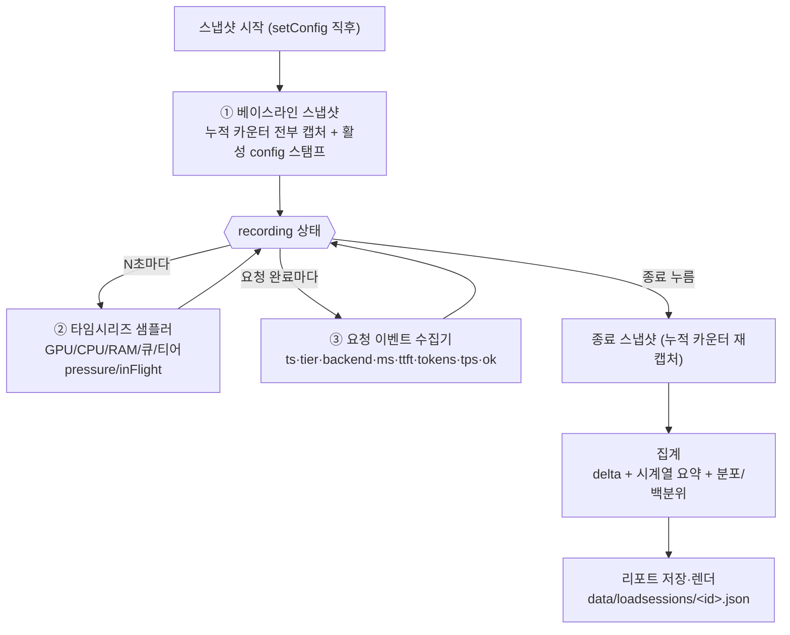
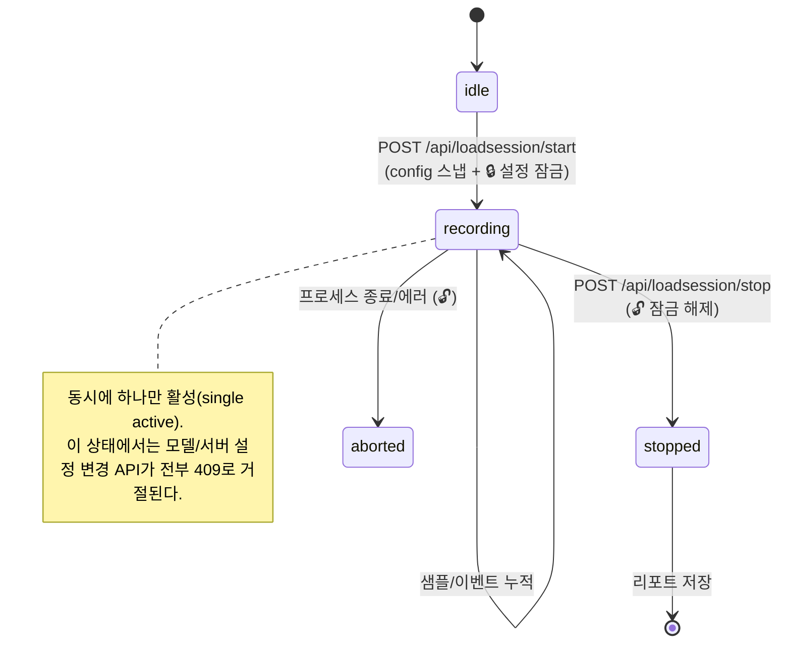

# 부하 스냅샷 세션 (Load Snapshot Session) — 튜닝 계측 워크플로우

> 목적: 고객사 현장에서 **모델 구성/`ngl`(n-gpu-layers)/`parallel` 값을 바꿔가며 튜닝**할 때,
> "설정 A로 바꿔놓고 → **스냅샷 시작** → 일정 시간 부하 → **스냅샷 종료** → 그간의 부하가 어디서 어떻게 걸렸는지 리포트" 를 만든다.
> 그 리포트로 다음 미세조정을 결정하고, **세션끼리 비교**해 설정 A vs 설정 B의 우열을 가린다.
>
> 설계 원칙: **기존 누적 카운터는 차분(delta)으로 재활용**하고, 영속 저장이 없는 지표(TTFT·tps·백엔드별 토큰·지연 분포)만 **세션 수집기**로 새로 담는다. 순간값(GPU/큐/inFlight)은 **주기 샘플링**한다.

---

## 0. 왜 이 기능이 필요한가 (원천 공백)

현재 시스템의 성능 데이터는 튜닝 판단에 **그대로 쓰기 어렵다**:

| 문제 | 현재 상태 |
|---|---|
| 누적 카운터는 **프로세스 수명 전체** 합 | 백엔드 `totalRequests/totalLatencyMs`, `stats.byTier` — "방금 바꾼 설정 구간"만 떼어볼 수 없음 |
| 요청별 이력은 **120개 링** (`_jobHistory`) | 한 달·수천 건 부하에서 대부분 유실 |
| TTFT·tokens/sec | **어디에도 영속 저장 안 됨** — SSE 응답 1회성 + 비정형 로그 라인뿐 |
| GPU/CPU/RAM | **순간값** — 지나간 부하의 피크 시각을 못 봄 |
| 큐 거절/타임아웃/강등 | 누적값만 — 구간 발생 건수를 못 뗌 |

→ **"시작~종료 사이"라는 시간 경계**를 세우고, 그 안의 부하를 세 방식으로 담아 하나의 리포트로 묶는 것이 이 기능의 핵심.

---

## 1. 핵심 설계 — 3계층 수집

한 세션은 세 종류의 데이터를 동시에 담는다. 각각 원천 성격이 다르기 때문이다.



### ① 베이스라인/종료 delta (재활용 — 신규 계측 0)
세션 시작·종료 시점에 **누적 카운터를 통째로 스냅**하고 종료-시작 차분을 낸다. 구간 총량은 이걸로 거의 다 나온다.

담는 원천 (모두 이미 존재):
- 백엔드별: `totalRequests / chatRequests / routerRequests / plannerRequests / securityRequests / totalErrors / totalLatencyMs` (`src/pool.js:72-78`)
- 티어별: `stats.byTier[t].{requests, tokens, totalMs}` (`src/stats.js:17-19`) ← **전역 토큰의 유일한 정형 원천**
- 큐: `_queueStats.{enqueued, started, rejected, timedOut, peakDepth}` (`src/pool.js:213-221`)
- 강등: `_loadStats.{demoteLargeToMedium, skippedHardLock, skippedFreeOk, skippedHighDiff}` (`src/pool.js:223-230`)

### ② 타임시리즈 샘플러 (순간값 → 시간 축)
`recording` 동안 **N초마다**(기본 5s) 순간값을 찍어 배열에 append. "언제 피크였나"를 이걸로 본다.

샘플 한 점(원천 모두 존재):
- 티어별 `pressure/used/cap/free` — `pool.slotSnapshot().byTier` (`src/pool.js:326-379`)
- 전역 `totalInFlight`, `requestsLastMin` — `pool.status()` (`src/pool.js:2143,2146`)
- 큐 `depth / running / oldestWaitMs` — `queueSnapshot()` (`src/pool.js:281-316`)
- GPU별 `utilPct / memUsedMb / memTotalMb / tempC / powerW`, CPU `usagePct`, RAM `usagePct` — `getMetrics()` (`src/metrics.js:126-140`)

> 샘플 간격은 세션 길이에 맞춰 **적응형**: 목표 최대 포인트 수(예: 2000)를 넘기지 않도록 긴 세션은 간격을 늘리거나 rollup. 한 달을 5초로 찍으면 50만 포인트 → 반드시 상한/롤업 필요.

### ③ 요청 이벤트 수집기 (영속 공백 메움) — **모든 호출 종류**
영속 저장이 없는 **요청 단위 성능**을 세션 버퍼에 담는다. delta로는 못 내는 **분포(p50/p95/p99)와 백엔드별 토큰**을 여기서 얻는다.
**결정: 채팅뿐 아니라 라우터·설계·임베딩·보안검증 호출까지 전부 담는다.** (각 호출도 GPU/슬롯을 먹으므로 튜닝 판단에 포함되어야 함)

이벤트 한 건:
```
{ ts, kind, tier, routedTier, loadDemoted, backend, alias,
  ms, ttftMs, tokensPerSec, tokens(completion), promptTokens, ok, error }
```
- `kind`: `solve`(답변) | `router`(분류) | `planner`(파이프라인 설계) | `embed`(임베딩) | `security`(보안검증). 리포트는 kind별로 나눠 집계(예: 라우터 호출이 전체 요청의 몇 %·평균 몇 ms인지 → 소형 모델 라우팅 오버헤드 튜닝 근거).
- `ttftMs`/`tokensPerSec`는 스트리밍 답변에만 유효 → 다른 kind는 `null`, 지연(`ms`)·성공여부·토큰만.

수집 지점(각 dispatch의 `finally` — 이미 `inFlight--`/`recordChat` 하는 바로 그 자리):
| kind | 위치 |
|---|---|
| solve 스트림 | `_chatStreamDispatch` `src/pool.js:1788-1822` (ttft/totalMs 계산 지점) |
| solve 비스트림 | `_chatDispatch` `src/pool.js:1614-1663` |
| router / planner | `classify` `src/pool.js:1154-1188` |
| embed | `embed` `src/pool.js:1863-1897` |
| security | `runSecurityCheck` `src/pool.js:2055-2099` |

각 지점에서 `this._loadSink?.pushEvent({...})` 한 줄. 단일 sink이므로 **pool 내부 한 계층에서 전 경로 커버**(라우트 핸들러 분산 훅 불필요).

> 링(`_jobHistory` 120)을 대체하는 것이 아니라 **세션 전용 버퍼**를 따로 둔다. 세션 버퍼도 상한을 두되(예: 최근 5만 건 + 초과분은 롤업 통계로 접기), 백분위/평균은 스트리밍 집계(reservoir 또는 t-digest 근사)로 상시 갱신해 원본 유실과 무관하게 정확도 유지.

---

## 2. 세션 상태 머신 + 설정 잠금(config lock)



- **동시 1개**만 활성(단순·명확).
- **핵심: 세션 = 튜닝 로그. 측정 구간 내내 설정이 불변이어야 delta·비교가 유효하다.** 따라서 recording 중에는 **설정 변경을 아예 막는다**(경고·자동재시작이 아니라 차단). 바꾸려면 `stop` → 변경 → 새 `start`.
- 프로세스가 죽어도 세션이 날아가지 않게 **주기적 플러시**(예: 30s마다 부분 저장) → `aborted`로라도 복구.
- 종료 없이 프로세스가 재시작되면 다음 부팅에서 미종료 세션을 `aborted`로 마감(잠금도 함께 해제).

### 잠금 대상 엔드포인트 (recording 중 409 `session-locked`)
설정을 바꾸는 **모든 변이(mutating) 라우트**를 게이트로 막는다. 로컬·원격(agent 프록시) 양쪽:

| 그룹 | 엔드포인트 |
|---|---|
| 로컬 서버/모델 | `POST/PATCH/DELETE /api/servers[/:name]`, `POST /api/servers/:name/start\|stop` |
| 로컬 역할/보안 | `POST /api/backends/role`, `POST /api/backends/security-policy`, `PUT /api/security/enabled` |
| 원격(agent) | `POST /api/agents/:id/servers`, `.../servers/:name/{start,stop,restart,role,security-policy}`, `PATCH/DELETE .../servers/:name`, `POST /api/agents/:id/restart` |
| 역할/정책 카탈로그 | `POST/PATCH/DELETE /api/roles[/:id]`, `POST/PATCH/DELETE /api/security-policies[/:id]` |

- 구현: 이들 핸들러 앞에 **공통 미들웨어 `assertNoActiveSession`** 하나. `loadSession.active()`가 있으면 `409 {error:"session-locked", sessionId, message:"부하 스냅샷 세션 중에는 설정을 변경할 수 없습니다. 세션을 종료한 뒤 변경하세요."}`.
- **읽기(GET)·채팅·스냅샷 stop은 잠금 대상 아님.** 오직 설정을 바꾸는 쓰기만.
- UI도 recording 중엔 관리 화면(server-admin/roles/security)의 편집 컨트롤을 **비활성화 + 배너**("세션 진행 중 — 설정 잠김")로 표시해 서버 거절 전에 막음(이중 방어).
- 이 잠금이 있으므로 `configAtStart`는 **세션 전 구간의 실제 설정과 동일**이 보장된다(§3의 별도 변경감지 플래그 불필요).

---

## 3. 데이터 모델

### 세션 객체 `data/loadsessions/<id>.json`
```jsonc
{
  "id": "ls_20260812_1530",
  "label": "medium par 8→12 실험",          // 사용자 입력 (어떤 설정 변경인지)
  "note": "large ngl 60, medium par 12로 올림", // 자유 메모
  "state": "stopped",
  "startedAt": "...", "endedAt": "...", "durationMs": 3600000,

  "configAtStart": { /* servers.json 스냅 — 티어/device/ngl/parallel/ctx. 잠금 덕에 전 구간 불변 */ },
  "configLocked": true,                        // 세션 중 설정변경 차단됨을 명시(감사용)

  "baseline": { /* 시작 시 누적 카운터 원본 */ },
  "final":    { /* 종료 시 누적 카운터 원본 */ },

  "delta": {                                  // final - baseline
    "byTier":   { "small": {...}, "medium": {...}, "large": {...} },
    "byBackend":[ { "url","alias","tier","requests","errors","latencySumMs","avgMs" } ],
    "queue":    { "enqueued","started","rejected","timedOut","peakDepth" },
    "loadAware":{ "demoteLargeToMedium", ... },
    "totals":   { "requests","tokens","errors","errorRatePct" }
  },

  "series": {                                 // 타임시리즈 요약 + (다운샘플된) 원본
    "intervalMs": 5000,
    "points": [ { "ts","tier":{...pressure},"gpu":[...],"cpuPct","ramPct","queueDepth","inFlight","reqLastMin" } ],
    "summary": {                              // 시계열에서 뽑은 판단용 요약
      "gpu":  [ { "index","utilAvg","utilPeak","memPeakMb","memPeakPct","tempPeak","powerPeakW","utilPeakAt" } ],
      "tierPressure": { "large": {"avg","peak","satRatio"}, ... }, // satRatio=pressure≈1 이었던 시간 비율
      "queue": { "depthPeak","depthAvg","secondsWithReject" }
    }
  },

  "requests": {                               // 요청 이벤트 집계
    "count": 5321,
    "latency":     { "p50","p90","p95","p99","max","avg" },     // ms (총)
    "ttft":        { "p50","p95","avg" },
    "tokensPerSec":{ "p50","p95","avg","min" },
    "byTier":    { "large": { "count","p95Ms","avgTps","tokens" }, ... },
    "byBackend": [ { "url","alias","count","errorRatePct","p95Ms","avgTps","tokens" } ],
    "demotedCount": 214                        // large→medium 강등된 요청 수
  },

  "verdict": [ /* §5 자동 진단 규칙 결과 (튜닝 제안) */ ]
}
```

### 원본 보존
- `baseline`/`final`은 **원본 카운터 그대로** 저장 → 나중에 집계식을 바꿔도 재계산 가능(로그-먼저 원칙과 동일).
- `series.points`는 다운샘플/롤업 후 저장하되 상한 준수.

---

## 4. 재활용 맵 (원천 → 세션 필드)

| 세션 산출 | 재활용 원천 | 파일 | 신규 코드 |
|---|---|---|---|
| 티어별 구간 요청/토큰/지연 | `stats.byTier` 차분 | `src/stats.js:17-19` | 스냅 2회 |
| 백엔드별 구간 요청/에러/지연 | `Backend` 카운터 차분 | `src/pool.js:72-78` | 스냅 2회 |
| 큐 거절/타임아웃/피크 | `_queueStats` 차분 | `src/pool.js:213-221` | 스냅 2회 |
| large→medium 강등 건수 | `_loadStats` 차분 | `src/pool.js:223-230` | 스냅 2회 |
| 티어 pressure 시계열 | `slotSnapshot().byTier` 샘플 | `src/pool.js:326-379` | 샘플러 |
| GPU util/VRAM/temp/power 시계열 | `getMetrics().gpus` 샘플 | `src/metrics.js:126-140` | 샘플러 |
| 큐 depth/inFlight 시계열 | `queueSnapshot()/status()` 샘플 | `src/pool.js:281-316, 2143` | 샘플러 |
| **지연 분포 p50/p95/p99** | ⚠️ 영속 없음 | — | **이벤트 훅 (신규)** |
| **TTFT / tokens/sec** | ⚠️ 영속 없음 (SSE 1회성) | `src/pool.js:1788`, `src/server.js:2915` | **이벤트 훅 (신규)** |
| **백엔드별 토큰** | ⚠️ 영속 없음 | — | **이벤트 훅 (신규)** |
| 활성 config 스탬프 | `servers.json` / `pool.snapshot()` | `src/serverManager.js`, `src/pool.js:119` | 시작 시 캡처 |

**정말 새로 짜는 것**: 세션 저장소 1개(`src/loadSession.js`) + 샘플러 타이머 1개 + dispatch 이벤트 훅 1곳 + API 6개 + UI(컨트롤 + 리포트).

---

## 5. 리포트가 답해야 하는 질문 → 튜닝 노브 (핵심 가치)

리포트는 숫자 나열이 아니라 **"어느 노브를 어느 방향으로"** 를 짚어야 한다. 자동 진단(`verdict`) 규칙:

| 관측 신호 (세션 필드) | 해석 | 제안 노브 |
|---|---|---|
| `queue.rejected>0` 또는 `timedOut>0`, 특정 티어 `satRatio` 높음 | 그 티어 용량 부족 | 해당 티어 `parallel`↑ 또는 백엔드 추가 |
| `loadAware.demoteLargeToMedium` 빈발 + large `satRatio` 높음 | large 상시 포화 (강등으로 버티는 중) | large `parallel`↑ 또는 large 백엔드 추가 |
| GPU `memPeakPct` 낮음(여유 큼) + `tokensPerSec` 낮음 | VRAM 놀고 있음, GPU 오프로드 여지 | `ngl`↑ (GPU 계층 더 올림) |
| GPU `memPeakPct` ≈100 근접 | VRAM 포화 — OOM/스와핑 위험 | `ngl`↓ 또는 `parallel`↓ |
| 특정 백엔드만 `errorRatePct` 높음 | 그 백엔드/모델 불안정 | 해당 서버 설정·모델 점검 |
| 티어 pressure 편중(large만 높고 small/medium 놀고) | 라우팅 난이도 분포 불균형 | 티어 배정·난이도 임계 재검토 |
| `ttft` p95 큰데 `tokensPerSec`는 정상 | 프롬프트 처리(prefill) 병목 | `ctx`/배치·`ngl` prefill 영향 점검 |
| 전 구간 `pressure` 낮고 지연 양호 | 여유 있음 | `parallel`↓로 VRAM 회수 or 모델 축소 여지 |

> 규칙은 임계값 설정 가능(config)하게. 처음엔 **경고 문구 + 근거 수치**만 내고, 자동 변경은 하지 않는다(사람이 결정).

### 세션 비교 (A/B 튜닝의 완성)
`GET /api/loadsession/compare?a=..&b=..` — 두 세션의 `delta.totals`, `requests.p95/avgTps`, `series.summary.gpu`, `queue.rejected`, `demotedCount`를 **나란히** 표로. "par 8 vs par 12" 처럼 설정 라벨과 함께 승패를 본다. 이게 미세조정 루프의 종착점.

---

## 6. API 설계

| 메서드·경로 | 동작 |
|---|---|
| `POST /api/loadsession/start` | body `{label, note}`. baseline 캡처 + config 스탬프 + 샘플러 시작 → `{id, state:"recording"}`. 이미 recording이면 409(또는 `?force=1`로 기존 stop 후 시작) |
| `POST /api/loadsession/stop` | final 캡처 + 집계 + 저장 → 리포트 반환 |
| `GET /api/loadsession/active` | 현재 recording 세션의 라이브 요약(경과시간, 지금까지 요청수, 현재 pressure) — UI 라이브 표시용 |
| `GET /api/loadsession` | 저장된 세션 목록(id/label/기간/요약) |
| `GET /api/loadsession/:id` | 세션 리포트 전체 |
| `DELETE /api/loadsession/:id` | 세션 삭제 |
| `GET /api/loadsession/compare?a=&b=` | 두 세션 비교표 |

**설정 잠금 미들웨어**: §2의 잠금 대상 변이 라우트 전부에 공통 `assertNoActiveSession` 미들웨어를 건다. `loadSession.active()`면 409 `session-locked`.

**이벤트 훅 배선 (확정)**: `startAgentPolling` 근처에서 세션 모듈 초기화 + `pool.setLoadSink(loadSession)`. **훅은 pool 내부 각 dispatch의 `finally`에** 둔다(안 A 확정 — 단일 계층에서 전 kind 커버, 라우트 분산 훅 없음). tps는 solve 스트림 지점에서 `completion_tokens/genMs`로 계산, 다른 kind는 `ms`만. sink가 없거나 활성 세션이 없으면 `pushEvent`는 즉시 no-op(오버헤드 0).

---

## 7. UI

- **monitor.html 상단에 스냅샷 컨트롤 바**: `[● 스냅샷 시작]` / 입력(label·note) / recording 중이면 `⏺ 00:12:34 · 요청 1,204 · large pressure 0.9` 라이브 뱃지 + `[■ 종료]`.
  - 재활용: monitor는 이미 `/api/status`·`/api/metrics`를 폴링 중 → 라이브 뱃지는 `/api/loadsession/active` 한 줄 추가 폴링.
- **신규 페이지 `public/loadsessions.html`** (nav "운영" 그룹에 추가): 세션 목록 + 리포트 뷰.
  - 리포트 뷰 구성: ⓐ 요약 카드(기간·총요청·에러율·강등수) → ⓑ `verdict` 진단 배너(튜닝 제안) → ⓒ 시계열 차트(GPU util/VRAM/pressure/queueDepth를 시간축) → ⓓ 지연/tps 분포(p50/p95/p99) → ⓔ 백엔드·티어 표 → ⓕ 시작 config 스냅.
  - 비교 탭: 세션 2개 선택 → 나란히.

---

## 8. Phase 구현 순서

### Phase 0 — 세션 저장소 + delta (신규 계측 0) ✅ 구현·검증 완료
- [x] `src/loadSession.js` — `start({label,note,force})` / `stop()` / `active()` / `list()` / `get(id)` / `remove(id)`. 인메모리 활성 세션 1개 + `data/loadsessions/<id>.json` 영속(시작 시 부분 저장, 종료 시 완성).
- [x] `start`에서 baseline 캡처: `pool.loadCounters()`(백엔드 원시 카운터+queue+loadAware, `src/pool.js`에 신설) + `getStats()`(티어 토큰) + config 스탬프(`loadServerDefs()`의 ngl/ctx/parallel/gpu + 풀 백엔드).
- [x] `stop`에서 final 캡처 후 **delta 계산**(byTier·byBackend·queue·loadAware·totals)만 저장(시계열·이벤트 없이).
- [x] API `start/stop/active/list/:id/DELETE :id` 배선(`src/server.js`).
- [x] **설정 잠금 미들웨어** — §2 잠금 대상 변이 라우트 전부에 정규식 매칭 미들웨어 1개(`src/server.js`, static 직후 마운트). recording 중 409 `session-locked`.
- **DoD 검증**: 스모크 테스트로 확인 — start→recording, `POST /api/servers`·역할/보안 변경 **409 차단**, `GET /api/status`·`estimate-vram` 통과, 중복 start 409, stop 후 리포트에 config 스탬프(ngl/par 캡처)·delta 생성, stop 후 unlock. (트래픽 delta 실측은 백엔드 있는 환경에서 Phase 1과 함께)

### Phase 1 — 타임시리즈 샘플러 ✅ 구현·검증 완료
- [x] 세션 recording 동안 `intervalMs`(기본 5s)마다 `slotSnapshot()`+`queueSnapshot()`+`getMetrics()` 샘플. 점 상한(기본 2000) 초과 시 **인접 2점을 avg/max 로 병합(피크 보존) + 간격 2배**(상한 5분) → 기간 무관 바운드. `configureSampler({baseMs,maxMs,maxPoints})`로 조정.
- [x] `stop` 시 `series.summary`: GPU util 평균/피크·**피크시각**·VRAM 피크%·온도·전력, 티어 압박 평균/피크/**포화시간비율(satRatioPct)**, 큐 depth 평균/피크. 차트용 압축 점 배열 동봉.
- [x] recording 중 **1분마다 플러시**에 series 부분본 포함(크래시 복구).
- [x] 리포트 UI: GPU 사용률/VRAM/large 압박/큐 **스파크라인 SVG**(avg 실선 + 피크밴드) + 요약 표.
- **DoD 검증**: 실측 RTX 3090 9초 녹화 → 20점, GPU util 평균20/피크75%(피크시각 포함)·VRAM 99%·전력 120W, 롤업으로 점≤상한·간격 자동확대 확인. 브라우저에서 시간축 차트 4종 + 요약표 렌더 확인.

> 교훈 반영: 에러 집계(카운터+최근샘플)와 동일하게, 시계열도 **점 상한+롤업(peak 보존)+간격 적응**으로 일주일 세션에서도 메모리·파일 바운드. 개별 원본 무한저장 없음.

### Phase 2 — 요청 이벤트 수집 + 분포 (전 kind)
- [ ] `pool.setLoadSink()` 훅을 **5개 dispatch finally 전부**에 push (solve 스트림/비스트림·router/planner·embed·security — §1 ③ 표).
- [ ] `stop` 시 지연/ttft/tps **백분위**(p50/p95/p99) + 백엔드별·티어별·**kind별** 집계. 스트리밍 집계로 상한 초과에도 정확.
- **DoD**: direct 채팅에도 지연 p95·tps가 나오고(현재 영속 공백 해소), 백엔드별 토큰·에러율, **kind별 호출 비중·평균 지연**(라우터/임베딩/보안 오버헤드 포함)이 표로 나온다.

### Phase 3 — 진단·비교·UI (튜닝 루프 완성)
- [ ] `verdict` 자동 진단 규칙(§5) + 임계 config화.
- [ ] `GET /api/loadsession/compare` + `public/loadsessions.html`(목록·리포트·비교) + monitor 컨트롤 바.
- [ ] **UI 설정 잠금 이중방어**: recording 중 server-admin/roles/security 페이지의 편집 컨트롤 비활성화 + "세션 진행 중 — 설정 잠김" 배너.
- [ ] 크래시 복구: 주기 플러시 + 부팅 시 미종료 세션 `aborted` 마감(잠금 해제 포함).
- **DoD**: "설정 바꿈 → 시작 → 종료 → 진단 배너가 노브 제안 → 다음 설정 → 두 세션 비교"가 UI만으로 도는 미세조정 루프 완성.

---

## 9. 비범위 (이번에 의도적으로 보류)

- **세션 중 설정 변경 허용** — 하지 않는다. 변경은 반드시 `stop` → 변경 → 새 `start`. (측정 구간 불변 보장이 튜닝 로그의 전제)
- **자동 튜닝**(제안대로 ngl/par를 시스템이 바꿈) — 진단은 하되 변경은 사람이. 후속.
- **원격 agent 노드의 GPU 시계열 통합** — 1차는 부모(로컬) metrics 기준. agent별 `GET /agent/metrics`를 세션 샘플러가 팬아웃 수집하는 것은 Phase 4 후보.
- **초장기(수일) 원포인트 저장 최적화**(별도 TSDB) — 우선 JSON + 롤업으로. 병목 증명되면 교체.
- **요청 원문/프롬프트 저장** — 성능 지표만. 원문은 기존 `history.jsonl` 담당.

---

## 10. 결정 사항

### 확정
- **이벤트 훅 범위** → **전 kind**: solve·router·planner·embed·security 모두 수집(§1 ③).
- **세션 중 config 변경** → **차단(설정 잠금)**: recording 중 변이 라우트 409, UI 컨트롤 비활성화. 변경은 stop 후에만(§2).

### 남은 결정
- **샘플 간격 기본값**과 최대 포인트 상한(예: 5s / 2000점, 초과 시 롤업 vs 간격 확대).
- **백분위 계산**: 전량 버퍼(정확, 메모리 부담) vs t-digest 근사(상수 메모리). 긴 세션은 근사 권장.
- **강등 요청을 "large 실패"로 볼지**: `demotedCount`를 품질 저하로 카운트할지 용량 적응으로 볼지(튜닝 관점 정의).
