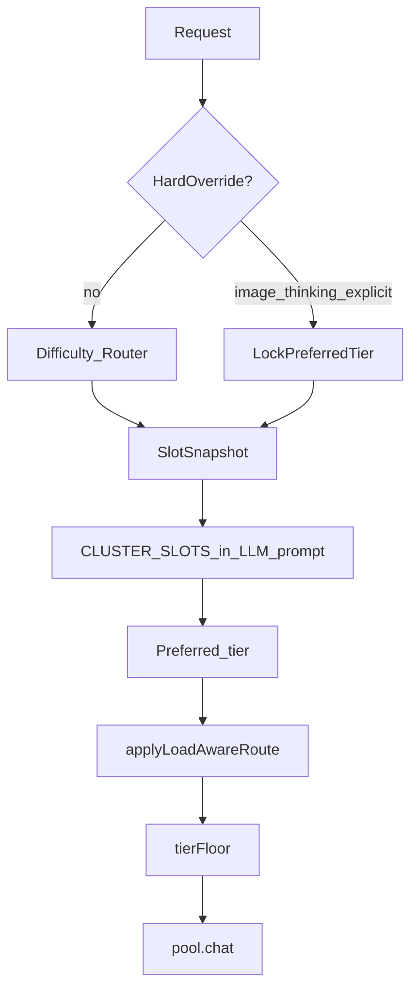

# 슬롯 인지 라우팅 워크플로우

> 목표: 난이도 기반 티어 판정은 유지하되, solve 모델별 **parallel 슬롯 사용량**을 반영해 large·medium 용량을 유동 배분한다.  
> LLM 라우터에는 슬롯 스냅샷을 **힌트**로 주고, 최종 배분은 **결정적 load-aware 레이어**가 담당한다.

---

## 배경

| 구분 | 역할 |
|------|------|
| 난이도 라우터 | 질문 품질에 맞는 preferred tier (small/medium/large) |
| 슬롯 (parallel) | 모델이 **동시에** 소화하는 용량 (예: large=4, medium=8) |
| 문제 | preferred=large 만 고집하면 large 슬롯 포화 시 대기열이 늘고 medium 여유는 낭비 |

---

## 파이프라인

1. **Hard override** (이미지 / THINKING / `MODEL_TIER`) → 강등 금지  
2. **난이도 라우터** (LLM 또는 휴리스틱) → preferred tier + difficulty  
3. **`pool.slotSnapshot()`** → 티어별 `cap / used / free`  
4. **LLM 힌트** → `CLUSTER_SLOTS` (권위 없음)  
5. **`applyLoadAwareRoute`** → large 포화 + 중간 난이도면 medium 강등  
6. **tierFloor** → 입력 길이 하한 (기존)

---

## 강등 규칙 (결정적)

| 조건 | 동작 |
|------|------|
| Hard override | preferred 유지 |
| preferred 티어 여유(`cap-used > 0`) | 유지 |
| preferred=large, large 여유≤0, medium 존재, difficulty &lt; 임계 | **medium 강등** (`load-demote`) |
| 이후 large 슬롯이 다시 비면 | **large 복귀** (preferred 유지, 강등 안 함) |
| preferred=large, difficulty ≥ 임계 | large 유지 (품질 우선) |
| 같은 티어 복수 서버 | 기존 least-inFlight |

스트레스 병렬: `Promise.all` 32발 동시 시작 대신 **슬롯 합만큼만 동시 실행**. 한 건 끝날 때마다 다음 건이 `resolveRoute` → large 가 비면 다시 large.

### env

- `LOAD_AWARE=on|off` (기본 `on`)
- `LOAD_DEMOTE_MAX_DIFFICULTY=75` — 이 미만만 large→medium 허용

---

## 파일

| 파일 | 역할 |
|------|------|
| `src/pool.js` | `slotSnapshot()`, demote 카운터 |
| `src/loadAwareRoute.js` | `applyLoadAwareRoute` |
| `src/router.js` / `src/llmRouter.js` | 라우트 후 load-aware + 슬롯 힌트 |
| `src/routerShared.js` | `CLUSTER_SLOTS` 프롬프트 |
| `src/workflow.js` | `createPlan` 결과에 load-aware |
| `src/config.js` | `loadAware`, `loadDemoteMaxDifficulty` |

---

## 성공 기준

- [ ] large 슬롯 포화 + 중간 난이도 → medium + reason에 `load-demote`
- [ ] 이미지/THINKING → medium 강등 없음
- [ ] `/api/status` 또는 로그에 demote 횟수 확인 가능

---

## 비범위

- llama 내부 큐를 Express 큐로 이전
- WebSocket
- parallel 자동 스케일 (VRAM)
